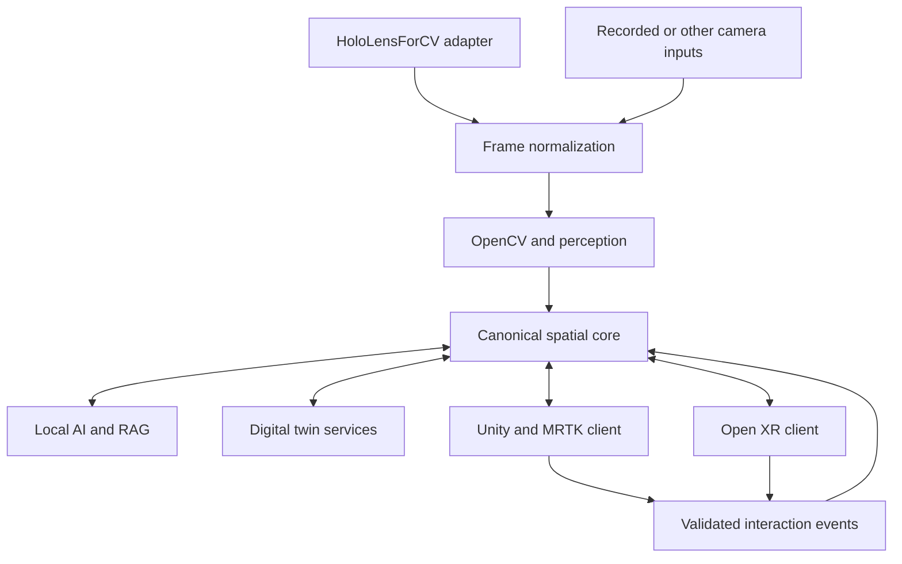

# JFXAI4MAR — Open-Source AI Alternative Integration Architecture

## AI-Powered Augmented Reality, Spatial Computing, Computer Vision & Digital Twin Platform

**Application focus: AI Healthcare, Security and Defense — modular XR research, training, inspection and human-supervised decision support.**

The expanded compendium integrates [HoloLensForCV](https://github.com/sdk2035/HoloLensForCV) for device-specific sensor acquisition and computer-vision research, and [MixedRealityToolkit-Unity](https://github.com/sdk2035/MixedRealityToolkit-Unity) for an optional Unity spatial-interaction client. These are proposed adapters, not a claim of an implemented or validated combined system. See [the integration compendium](#153-hololensforcv-and-mrtk-integration-compendium) for compatibility, interfaces and delivery milestones.

> **Repository:** `robotics-intelligent-systems/jfxai4mar`
>
> **Purpose:** reorganize the current JFXAI4MAR software compendium into a modular, open-source-first architecture for augmented reality, mixed reality, spatial computing, computer vision, visual-inertial tracking, local AI, 3D content generation, simulation, digital twins, geospatial visualization, embedded devices and AI-assisted engineering.
>
> **Core principle:** JFXAI4MAR should not be coupled to one XR runtime, one 3D engine, one computer-vision stack or one model provider. The platform should expose canonical interfaces for scene, pose, anchors, perception, model inference, digital-twin state, spatial interaction, simulation and rendering.
>
> **Open architecture objective:** create an architecture that is open, modular and standards-oriented, designed to minimize vendor lock-in and allow independent implementations.
>
> **Safety/privacy principle:** camera, spatial-map, biometric, wearable and location data must remain purpose-limited. AI-generated spatial actions should be validated before affecting real-world equipment or safety-relevant workflows.

---

# 1. Source Project Direction

The current JFXAI4MAR README describes an:

> **AI-Powered Augmented Reality Platform**

and references a heterogeneous ecosystem including:

- Comfy Desktop / ComfyUI;
- openmicro Codex desktop application;
- OpenVR;
- HoloLensForCV sensor acquisition, streaming and recording;
- MixedRealityToolkit-Unity spatial interaction and UI;
- opentrack;
- Maritime Autonomous Vehicle Monitoring and Response Framework (MAVMRF);
- Roboflow;
- Kubrick Blender simulation;
- Blender JBeam Editor;
- StableGen;
- `x3d_mcp`;
- AI Companion for O3DE;
- Cesium for Unreal;
- VulkanSceneGraph;
- ASAM OSI;
- Varjo OpenXR plugin;
- VINS-Mobile;
- MicroPython on Monocle;
- TensorFlow Lite for Microcontrollers;
- OCAML-NN;
- Kornia;
- SOD;
- SolARFramework;
- PyTorch SIMA implementation;
- NVIDIA DALI;
- Maid;
- XR-Objects / Augmented Object Intelligence;
- DeepReality Unity package;
- VIAME;
- Arm Compute Library;
- ARCore;
- OpenARK;
- OpenCV Mobile;
- Gzweb.

The repository also preserves:

```text
MBSE
├── CAD
├── CAM
└── CAS
```

The proposal below keeps those source components conceptually, but reorganizes them by capability rather than treating them as a single mandatory runtime stack.

---

# 2. Target Platform Vision

```text
REAL WORLD
   ↓
CAMERAS / IMU / GNSS / DEPTH / DEVICE SENSORS
   ↓
TRACKING + PERCEPTION
   ↓
SPATIAL WORLD MODEL
   ↓
DIGITAL TWIN / 3D SCENE
   ↓
AI / VLM / AGENTS / RAG
   ↓
SPATIAL INTERACTION
   ↓
XR / AR / WEB / DESKTOP / EMBEDDED CLIENTS
   ↓
USER FEEDBACK + TELEMETRY
   ↓
MODEL / TWIN / EXPERIENCE UPDATE
```

JFXAI4MAR becomes a **spatial-computing integration platform** rather than a single AR application.

---

# 3. High-Level Alternative Architecture

```text
┌─────────────────────────────────────────────────────────────────────┐
│                          JFXAI4MAR                                  │
│ Projects | Scenes | Assets | Devices | Tasks | Digital Twins       │
└──────────────────────────────┬──────────────────────────────────────┘
                               │
                               ▼
┌─────────────────────────────────────────────────────────────────────┐
│                   SPATIAL APPLICATION LAYER                         │
│ AR UI | XR Workspace | Spatial Dashboard | Training | Inspection   │
└──────────────┬──────────────────┬──────────────────┬────────────────┘
               │                  │                  │
               ▼                  ▼                  ▼
         XR RUNTIME          3D / GIS             AI / AGENTS
       OpenXR Adapter       Blender/O3DE        Local VLM/LLM
       OpenVR Legacy        VSG / X3D MCP       ComfyUI
               │                  │                  │
               └──────────────────┼──────────────────┘
                                  ▼
┌─────────────────────────────────────────────────────────────────────┐
│                     SPATIAL DATA FABRIC                             │
│ Pose | Anchors | Scene Graph | Assets | Events | Twin State        │
└──────────────┬──────────────────┬──────────────────┬────────────────┘
               │                  │                  │
               ▼                  ▼                  ▼
        TRACKING / SLAM       PERCEPTION       SIMULATION / TWIN
       VINS / SolAR          OpenCV/Kornia     Gazebo/Web
       opentrack             VIAME / models    ASAM OSI
               │                  │                  │
               └──────────────────┼──────────────────┘
                                  ▼
                       DEVICE / EDGE GATEWAY
                                  │
                     Mobile | Wearable | Edge
```

---

# 4. Architectural Layers

```text
Layer 1
Sensors / Cameras / Wearables / Embedded Devices

Layer 2
Pose Estimation / SLAM / Tracking

Layer 3
Perception / Computer Vision

Layer 4
Spatial World Model

Layer 5
Scene Graph / 3D / GIS / Digital Twin

Layer 6
AI / VLM / Agents / Generative Content

Layer 7
XR Runtime / Rendering

Layer 8
Application / Workflow

Layer 9
Telemetry / Evaluation / Governance

Layer 10
MBSE / CAD / CAM / CAS Integration
```

---

# 5. Capability Classification

Each source component should be classified as:

```text
CORE
Required architectural capability

CORE CANDIDATE
Recommended default implementation

OPTIONAL ADAPTER
Replaceable integration

DOMAIN SPECIALIST
Specialized industry use

RESEARCH / REFERENCE
Experimental or narrow research component

EXTERNAL / PLATFORM-SPECIFIC
Vendor/platform-specific integration
```

---

# 6. Source Component Classification

| Component | Main Role | Proposed Classification |
|---|---|---|
| Comfy Desktop / ComfyUI | Generative AI workflow | AI Tool / Core Candidate |
| openmicro Codex desktop | AI coding / desktop workflow | Optional AI Tool |
| OpenVR | XR runtime/API | Legacy / Optional Adapter |
| [HoloLensForCV](https://github.com/sdk2035/HoloLensForCV) | HoloLens sensor acquisition, recording and CV samples | Optional Device Adapter / Research Reference |
| [MixedRealityToolkit-Unity](https://github.com/sdk2035/MixedRealityToolkit-Unity) | Unity input, spatial interaction and UX components | Optional Engine Adapter / MRTK2 Compatibility Profile |
| opentrack | Head tracking | Core Candidate / Tracking |
| MAVMRF | Maritime monitoring | Domain Specialist |
| Roboflow | CV workflow/platform | External / Optional |
| Kubrick | Blender synthetic-data simulation | Core Candidate / Synthetic Data |
| Blender JBeam Editor | Vehicle/physics asset editing | Domain Specialist |
| StableGen | Generative AI in Blender | AI Content Tool |
| x3d_mcp | X3D exposed to LLMs | Core Candidate / MCP |
| AI Companion for O3DE | AI-assisted 3D development | Optional Adapter |
| Cesium for Unreal | 3D geospatial visualization | External / Engine-Specific |
| VulkanSceneGraph | High-performance scene graph | Core Candidate |
| ASAM OSI | Simulation interoperability | Core Candidate |
| Varjo OpenXR plugin | XR hardware integration | External / Device Adapter |
| VINS-Mobile | Visual-inertial localization | Core Candidate |
| MicroPython / Monocle | Wearable edge runtime | Edge / Research |
| TensorFlow Lite Micro | TinyML | Edge AI Candidate |
| OCAML-NN | Neural-network implementation | Research / Reference |
| Kornia | Differentiable CV | Core Candidate |
| SOD | Cross-platform ML | Edge / Optional |
| SolARFramework | AR tracking framework | Core Candidate |
| PyTorch SIMA | Generalist embodied/agent research | Research |
| NVIDIA DALI | Data pipeline acceleration | Optional / GPU-Specific |
| Maid | Local GGUF / llama.cpp UI | Local AI Tool |
| XR-Objects | Augmented object intelligence | Research / Spatial AI |
| DeepReality Unity | ML + AR integration | Engine-Specific |
| VIAME | Computer vision analytics | Domain Specialist |
| Arm Compute Library | Edge inference primitives | Core Candidate / Edge |
| ARCore | Mobile AR platform | External / Platform Adapter |
| OpenARK | Wearable AR system | Research / Hardware Reference |
| OpenCV Mobile | Mobile CV | Core Candidate |
| Gzweb | Web client for Gazebo Classic | Legacy / Simulation Adapter |

---

# 7. Open-Source-First Backbone

Recommended baseline:

```text
OpenXR
+
Blender
+
VulkanSceneGraph
+
OpenCV
+
Kornia
+
SolAR / VINS adapter
+
FastAPI
+
PostgreSQL
+
Qdrant or equivalent open vector store
+
llama.cpp / vLLM / Ollama profile
+
ComfyUI
+
MCP Gateway
+
Docker
```

Optional engines and device-specific stacks should remain behind adapters.

---

# 8. XR Runtime Strategy

Preferred abstraction:

```text
XRRuntimeProvider
├── initialize()
├── enumerate_devices()
├── get_head_pose()
├── get_controller_pose()
├── get_hand_tracking()
├── create_anchor()
├── render_frame()
└── shutdown()
```

Recommended profiles:

```text
OpenXR
→ preferred standard-facing runtime

OpenVR
→ legacy / compatibility

Device-specific plugins
→ optional adapters

HoloLensForCV
→ separate sensor/CV adapter; not an XR rendering runtime

MRTK-Unity
→ optional Unity interaction client over a validated XR provider
```

---

# 9. OpenXR as Canonical XR Boundary

Application logic should depend on:

```text
Pose
Input
Hands
Anchors
Views
Spaces
```

not on a specific headset vendor.

---

# 10. OpenVR Boundary

OpenVR can remain:

```text
LegacyXRProvider
```

for applications requiring compatibility with older OpenVR workflows.

New core features should target a more portable runtime abstraction.

---

# 11. Varjo Integration

The source compendium includes a Varjo OpenXR plugin.

Treat this as:

```text
XRDeviceAdapter
```

rather than a core dependency.

---

# 12. Spatial Pose Model

```yaml
pose:
  frame: world
  timestamp: "..."
  position:
    x: 0.0
    y: 0.0
    z: 0.0
  orientation:
    x: 0.0
    y: 0.0
    z: 0.0
    w: 1.0
  confidence: 0.95
  source: vins
```

---

# 13. Tracking Architecture

```text
Camera
   +
IMU
   +
Optional GNSS / Depth
      ↓
Calibration
      ↓
Tracking Provider
      ├── VINS
      ├── SolAR
      ├── opentrack
      └── platform adapter
      ↓
Canonical Pose
```

---

# 14. VINS-Mobile Role

VINS-Mobile can be used as a source-aligned visual-inertial localization reference.

Recommended abstraction:

```text
VisualInertialProvider
```

Outputs:

- pose;
- velocity;
- confidence;
- tracked-feature statistics;
- time synchronization metadata.

---

# 15. opentrack Role

`opentrack` is well suited to:

- head orientation;
- desktop simulation;
- simulator interaction;
- low-cost tracking experiments.

It should map into the same canonical pose model.

---

# 16. SolARFramework Role

SolAR can serve as a modular AR-tracking and perception candidate.

```text
Camera
  ↓
SolAR Pipeline
  ↓
Pose / Map / Features
  ↓
Spatial World Model
```

---

# 17. Spatial Anchor Model

```yaml
anchor:
  id: machine_A_panel
  frame: plant_world
  pose: ...
  persistence: project
  confidence: 0.92
  semantic_type: equipment_panel
  linked_asset: machine_A
```

---

# 18. Anchor Lifecycle

```text
DETECTED
   ↓
PROVISIONAL
   ↓
VALIDATED
   ↓
PERSISTENT
   ↓
UPDATED
   ↓
ARCHIVED
```

---

# 19. Spatial World Model

```text
World
├── Frames
├── Anchors
├── Objects
├── Surfaces
├── Humans
├── Equipment
├── Zones
├── Semantic Labels
└── Digital Twins
```

---

# 20. Scene Graph Architecture

Preferred:

```text
Canonical Spatial Scene
        ↓
SceneGraphProvider
        ├── VulkanSceneGraph
        ├── Blender
        ├── O3DE
        ├── X3D
        └── engine adapters
```

---

# 21. VulkanSceneGraph Role

VSG is a strong candidate for:

- high-performance scene representation;
- Vulkan-based rendering;
- large scenes;
- engineering visualization.

It can act as a native open scene/rendering profile.

---

# 22. Blender Role

Blender should be used for:

- 3D asset creation;
- scene authoring;
- synthetic data generation;
- simulation preparation;
- content validation;
- procedural geometry.

Blender should not be forced to own runtime XR state.

---

# 23. Blender Asset Pipeline

```text
CAD / Source Asset
      ↓
Blender
      ↓
Cleanup / UV / Materials
      ↓
LOD Generation
      ↓
glTF / scene format
      ↓
Asset Registry
```

---

# 24. Kubrick Role

Kubrick can provide synthetic-data generation:

```text
Scene
  ↓
Randomization
  ↓
Rendering
  ↓
Images
Masks
Depth
Optical Flow
Metadata
  ↓
Training Dataset
```

---

# 25. Synthetic Data Architecture

```text
Digital Twin / 3D Asset
        ↓
Scenario Generator
        ↓
Domain Randomization
        ↓
Blender / Kubrick
        ↓
Synthetic Dataset
        ↓
CV Training
        ↓
Real-World Validation
```

---

# 26. StableGen Role

The source compendium describes StableGen as a Blender generative-AI add-on.

Use it behind:

```text
GenerativeAssetProvider
```

Potential tasks:

- concept generation;
- material generation;
- texture ideation;
- rapid environment creation.

Human review remains required for engineering assets.

---

# 27. ComfyUI Architecture

```text
Prompt / Reference
      ↓
ComfyUI Workflow
      ↓
Image / Texture / Concept
      ↓
Asset Review
      ↓
Blender / Scene
```

JFXAI4MAR should treat ComfyUI workflows as versioned assets.

---

# 28. Comfy Workflow Registry

```yaml
workflow:
  id: industrial_texture_v2
  engine: comfyui
  inputs:
    - reference_image
    - prompt
  outputs:
    - texture
  intended_use: concept_visualization
```

---

# 29. Computer Vision Architecture

```text
Camera / Video
      ↓
Preprocessing
      ↓
CV Pipeline
      ├── detection
      ├── segmentation
      ├── tracking
      ├── matching
      ├── geometry
      └── classification
      ↓
Canonical Perception Object
```

---

# 30. Canonical Perception Object

```yaml
perception_object:
  id: valve_12
  class: valve
  confidence: 0.96
  bbox: [...]
  pose: ...
  attributes:
    state: open
  provenance:
    camera: wearable_front
    model: detector_v4
```

---

# 31. OpenCV Role

OpenCV should be the general baseline for:

- image processing;
- calibration;
- feature extraction;
- geometry;
- tracking utilities;
- camera pipelines.

---

# 32. OpenCV Mobile Role

For constrained devices:

```text
OpenCV Mobile
→ reduced mobile/embedded CV profile
```

Use the same canonical perception interfaces as desktop/edge nodes.

---

# 33. Kornia Role

Kornia is useful for:

- differentiable vision;
- geometric transformations;
- augmentation;
- model-integrated vision pipelines;
- research-grade CV.

---

# 34. VIAME Role

VIAME should remain a specialized CV analytics profile.

Potential domains:

- maritime;
- environmental observation;
- large video collections;
- tracking/classification workflows.

---

# 35. Roboflow Boundary

Because the source compendium references Roboflow, treat it as:

```text
ExternalCVPlatformAdapter
```

JFXAI4MAR core should still support fully local/open data and model workflows.

---

# 36. CV Provider Interface

```text
CVProvider
├── detect()
├── segment()
├── track()
├── classify()
├── estimate_pose()
└── get_model_metadata()
```

---

# 37. Model Provider Architecture

```text
ModelProvider
├── load()
├── infer()
├── metadata()
├── unload()
└── health()
```

Providers may use:

```text
PyTorch
ONNX Runtime
TensorFlow Lite
Arm Compute Library
llama.cpp
other local runtimes
```

---

# 38. Embedded AI Architecture

```text
Sensor
  ↓
Tiny / Edge Preprocessing
  ↓
Embedded Model
  ↓
Local Finding
  ↓
Spatial Event
  ↓
Optional Central Sync
```

---

# 39. TensorFlow Lite Micro Role

Use for highly constrained microcontrollers when:

- small models;
- deterministic memory;
- low power;
- no full OS;
- local inference is required.

---

# 40. Arm Compute Library Role

Strong candidate for:

- Arm CPU/GPU acceleration;
- embedded inference;
- mobile/wearable optimization.

---

# 41. SOD Role

SOD can remain an alternative lightweight ML / embedded inference component.

Use only behind:

```text
EdgeModelProvider
```

---

# 42. MicroPython / Wearable Profile

The source compendium references MicroPython on Monocle.

Architecture:

```text
Wearable Sensor
      ↓
MicroPython App
      ↓
Local Capture / Input
      ↓
Device Gateway
      ↓
JFXAI4MAR Spatial Session
```

---

# 43. OpenARK Role

OpenARK can remain a research/reference profile for open wearable AR.

Possible contribution:

- wearable hardware research;
- hand/scene interaction;
- open-device prototyping;
- spatial-interface experiments.

---

# 44. Local LLM Architecture

```text
User / Spatial Context
      ↓
Local AI UI
      ↓
llama.cpp / vLLM / Ollama
      ↓
RAG
      ↓
MCP Tools
      ↓
JFXAI4MAR
```

---

# 45. Maid Role

Maid can remain:

```text
LocalAIClient
```

for interacting with GGUF / llama.cpp-compatible local models.

It is an interface option, not the core AI runtime.

---

# 46. Spatial RAG

Knowledge sources:

```text
Equipment Manuals
CAD Metadata
Scene Objects
Maintenance Records
Procedures
GIS Layers
Simulation Results
Training Material
Digital Twin State
```

---

# 47. Spatial RAG Context

```text
User Location
    +
Visible Objects
    +
Selected Asset
    +
Current Task
    ↓
Context Builder
    ↓
RAG
    ↓
Spatial Answer
```

---

# 48. MCP Architecture

MCP can expose spatial tools to AI agents.

Examples:

```text
get_scene
get_visible_objects
get_anchor
get_asset_twin
query_manual
create_annotation
load_3d_asset
run_simulation
get_geospatial_context
```

---

# 49. x3d_mcp Role

The source compendium specifically references `x3d_mcp`.

Recommended architecture:

```text
LLM / Agent
     ↓
MCP Gateway
     ↓
x3d_mcp
     ↓
X3D Scene / Capability
```

Use it as a spatial-content tool provider rather than the entire scene runtime.

---

# 50. MCP Safety Boundary

AI agents should not receive unrestricted:

```text
modify_production_equipment
execute_vehicle_control
override_safety
publish_unreviewed_engineering_geometry
```

Spatial tools should distinguish read, draft and approved-write capabilities.

---

# 51. Spatial Agent Architecture

```text
User Goal
   ↓
Spatial Agent
   ↓
Scene Context
   ↓
RAG
   ↓
MCP Tools
   ↓
Proposed Spatial Action
   ↓
Policy / Human Approval
   ↓
Execution
```

---

# 52. SIMA Research Role

The source compendium references a PyTorch implementation of DeepMind's SIMA.

Treat it as:

```text
GeneralistSpatialAgentResearchProvider
```

Research topics:

- language-conditioned interaction;
- virtual environments;
- embodied agents;
- generalization across simulated worlds.

Do not make it a default production dependency.

---

# 53. AI Companion for O3DE

Recommended role:

```text
Optional O3DE Authoring Assistant
```

Use for:

- content creation;
- scripting support;
- project assistance;
- scene workflows.

O3DE should remain one engine adapter.

---

# 54. Engine-Neutral Design

Avoid:

```text
JFXAI4MAR
= Unity App
```

or:

```text
JFXAI4MAR
= Unreal App
```

Prefer:

```text
Spatial Core
   ↓
Rendering / Engine Adapter
   ├── VSG
   ├── O3DE
   ├── Blender visualization
   ├── X3D
   └── commercial engine adapter
```

---

# 55. DeepReality Boundary

The source compendium references a Unity package combining ML and AR.

Treat it as:

```text
UnityARMLAdapter
```

not as a platform dependency.

The same boundary applies to MRTK-Unity: keep Unity scene objects, input services and platform plugins inside the client adapter. Exchange engine-neutral poses, anchors, interaction events and annotations with the spatial core. HoloLensForCV sensor access is a separate native/device concern; a bridge between it and MRTK is proposed in Sections 153–160.

---

# 56. Cesium Integration

The source compendium references Cesium for Unreal.

Generalize the requirement as:

```text
GeospatialProvider
```

Capabilities:

```text
Terrain
3D Tiles
Coordinates
Georeferencing
Large-scale spatial assets
```

A Cesium/Unreal implementation can remain an optional adapter.

---

# 57. Open Geospatial Alternative

Recommended open-first approach:

```text
3D Tiles-compatible data
+
open geospatial services
+
VSG / web / engine adapters
```

The spatial model should not depend on Unreal-specific scene objects.

---

# 58. Geospatial Coordinate Model

```yaml
geo_anchor:
  id: turbine_07
  coordinate_reference: EPSG:4326
  latitude: ...
  longitude: ...
  altitude: ...
  local_frame: turbine_07_frame
```

---

# 59. Local ↔ Global Coordinates

```text
GNSS / GIS
   ↓
Global Frame
   ↓
Site Origin
   ↓
Local ENU / Project Frame
   ↓
XR Anchor
```

---

# 60. Maritime Profile

MAVMRF and VIAME suggest a maritime specialization.

```text
Vessel / Autonomous Vehicle
      ↓
Telemetry
      +
Video
      +
Geospatial Position
      ↓
JFXAI4MAR
      ↓
Spatial Operational View
      ↓
Detection / Tracking / Response Support
```

---

# 61. Maritime Digital Twin

```text
Vehicle
  ↓
ASAM OSI / Simulation Adapter
  ↓
Environment
  ↓
Sensors
  ↓
Spatial Dashboard
```

---

# 62. ASAM OSI Role

ASAM OSI should provide:

```text
Simulation Interoperability Adapter
```

Use for:

- simulated environment objects;
- sensor models;
- ground truth;
- autonomous-system testing.

---

# 63. Canonical Simulation Object

```yaml
sim_object:
  id: vehicle_12
  type: vehicle
  pose: ...
  velocity: ...
  dimensions: ...
  classification: ...
  source: asam_osi
```

---

# 64. Simulation Architecture

```text
Scenario Definition
      ↓
Simulation Provider
      ├── Gazebo
      ├── Blender/Kubrick
      ├── ASAM OSI-compatible systems
      └── domain simulator
      ↓
Synthetic Sensors
      ↓
JFXAI4MAR
```

---

# 65. Gzweb Role

The source README references Gzweb for Gazebo Classic.

Treat it as:

```text
LegacyGazeboWebAdapter
```

Future architecture should not depend specifically on Gazebo Classic.

---

# 66. Simulation Provider Interface

```text
SimulationProvider
├── load_scene()
├── spawn_object()
├── set_pose()
├── step()
├── get_ground_truth()
├── get_sensor_frame()
└── reset()
```

---

# 67. Simulation-to-AR Pipeline

```text
Simulation Scene
      ↓
Canonical Scene Objects
      ↓
Spatial Data Fabric
      ↓
AR Client
      ↓
Overlay
```

This enables digital-twin previews before real deployment.

---

# 68. Real-to-Sim Pipeline

```text
Camera / Scan / GIS
       ↓
Scene Reconstruction
       ↓
Asset Matching
       ↓
Digital Twin
       ↓
Simulation
```

---

# 69. Digital Twin Architecture

```text
Physical Asset
     ↓ telemetry + spatial data
Digital Twin
     ├── geometry
     ├── pose
     ├── state
     ├── health
     ├── history
     └── simulation model
     ↓
XR Representation
```

---

# 70. Twin Registry

```yaml
digital_twin:
  id: machine_A
  asset: plant.machine_A
  geometry: assets/machine_A.glb
  anchor: machine_A_anchor
  telemetry_source: jfxscada
  simulation_provider: optional
  state_schema: machine_state_v2
```

---

# 71. JFXSCADA Integration

```text
JFXSCADA
Live Industrial State
      ↓
Twin Adapter
      ↓
JFXAI4MAR
      ↓
Spatial Overlay
```

Potential overlays:

- machine state;
- alarms;
- health;
- energy;
- maintenance;
- production status.

---

# 72. SCADA Spatial Operations

```text
Technician looks at machine
         ↓
Anchor resolves asset
         ↓
JFXSCADA state
         ↓
AR overlay
         ↓
Alarm / trend / maintenance context
```

Commands should remain behind JFXSCADA authorization, not be executed directly from arbitrary AR gestures.

---

# 73. JFXOSMS Integration

```text
JFXOSMS
Microfactory Twin
      ↓
JFXAI4MAR
Spatial Production View
      ↓
Workcell
Robots
WIP
Machine Status
Assembly Instructions
```

---

# 74. Additive Manufacturing AR

```text
CAD Part
   ↓
AM Process Plan
   ↓
JFXOSMS
   ↓
JFXAI4MAR
   ↓
Spatial:
Printer setup
Build status
Post-processing
Inspection guidance
```

---

# 75. JFXAI4MHERS Integration

```text
Humanoid Robot
      ↓
JFXAI4MHERS
Task / Skill / State
      ↓
JFXAI4MAR
Spatial Robot Visualization
      ↓
Operator
```

Possible uses:

- planned trajectory preview;
- workcell safety visualization;
- robot state;
- teleoperation UI;
- task explanation.

---

# 76. Robot Spatial Safety Overlay

```text
Robot
├── Current Pose
├── Planned Motion
├── Reachable Workspace
├── Restricted Zone
└── Human Proximity
```

AR visualization is advisory; physical safety remains independent.

---

# 77. JFXFMIS Integration

```text
JFXFMIS
Farm Twin / GIS / Sensors
      ↓
JFXAI4MAR
      ↓
Field Overlay
Crop Zones
Irrigation
Equipment
Alerts
```

---

# 78. Agricultural AR

Potential workflows:

- equipment maintenance;
- field mapping;
- crop observation;
- irrigation diagnostics;
- digital-twin visualization;
- task guidance.

---

# 79. JFXOTBS / Aviation Integration

```text
Aircraft / Airport / Operations Twin
        ↓
JFXAI4MAR
        ↓
Maintenance / Training / Operations XR
```

Safety-critical aviation procedures require qualified validation.

---

# 80. Aircraft Maintenance AR

```text
Aircraft Asset
     ↓
Part / Zone Anchor
     ↓
Procedure
     ↓
AR Step
     ↓
Technician Confirmation
     ↓
Evidence
```

JFXAI4MAR should support procedure guidance, not replace approved maintenance documentation.

---

# 81. JFXAI4BPM Integration

```text
Business Process
      ↓
Human Task
      ↓
JFXAI4MAR Spatial Task
      ↓
Evidence / Completion
      ↓
JFXAI4BPM
```

Examples:

- inspection;
- assembly;
- maintenance;
- training;
- warehouse task.

---

# 82. Spatial Work Instruction

```yaml
spatial_task:
  id: inspect_valve_12
  process_id: maintenance_445
  asset: valve_12
  anchor: valve_12_anchor
  steps:
    - identify_asset
    - inspect_state
    - capture_evidence
    - confirm_completion
```

---

# 83. JFXLMS Integration

```text
JFXLMS
Learning Objective
      ↓
JFXAI4MAR
XR Scenario
      ↓
Learner Action
      ↓
Evidence
      ↓
JFXLMS Skill Graph
```

---

# 84. XR Training

Potential domains:

```text
Manufacturing
Maintenance
SCADA operations
Robotics
Agriculture
Aviation
Safety
Engineering
```

---

# 85. Training Evidence Contract

```yaml
learning_evidence:
  learner: learner_01
  scenario: pump_inspection_v3
  objective: identify_alarm_source
  result: success
  attempts: 2
  duration: 340s
```

---

# 86. JFXCMS Integration

```text
JFXCMS
Collaborative Development
      ↓
XR Project
      ↓
GitHub
      ↓
Scene / Code / Dataset / Model
      ↓
Review
      ↓
Portfolio Evidence
```

---

# 87. GitHub MCP Integration

Use GitHub MCP for:

- scene repository discovery;
- issue tracking;
- code review;
- CI;
- documentation;
- asset metadata;
- project coordination.

Do not use GitHub MCP as an XR real-time runtime.

---

# 88. Spatial Asset Versioning

Track:

```text
Asset ID
Source CAD
Mesh Version
Texture Version
LOD
Collision Geometry
Semantic Metadata
License
Commit
```

---

# 89. 3D Asset Registry

```yaml
asset3d:
  id: pump_P101_model
  version: 5
  format: gltf
  source: freecad_export
  semantic_type: centrifugal_pump
  license: verified
```

---

# 90. Scene Package

```text
scene.yaml
anchors.yaml
assets/
materials/
models/
procedures/
sim/
tests/
```

---

# 91. Local-First Privacy Architecture

```text
Camera / Mic / Spatial Map
       ↓
Local Processing
       ↓
Minimized Derived Data
       ↓
Optional Authorized Sync
```

Prefer local inference for sensitive wearable contexts when practical.

---

# 92. Biometric / Facial Data Boundary

The source compendium mentions ARCore facial tracking as an example of AI-assisted AR.

JFXAI4MAR should classify:

```text
Face Geometry
Eye Tracking
Voice
Body Tracking
```

as sensitive device/context data and minimize retention.

---

# 93. Location Privacy

Geospatial AR can expose:

- user location;
- facility locations;
- sensitive infrastructure;
- operational paths.

Use role-based geospatial visibility.

---

# 94. Camera Privacy

Recommended modes:

```text
Frame Local Only
Derived Detection Only
Blur / Redaction
Short-Term Buffer
Explicit Recording
```

Recording should not be assumed.

---

# 95. AI Content Provenance

Generated assets should include:

```text
Generator
Model
Workflow
Prompt Hash / Reference
Human Reviewer
Intended Use
```

---

# 96. Engineering vs Concept Assets

```text
AI-Generated Concept
       ≠
Approved Engineering Geometry
```

Engineering release requires explicit validation.

---

# 97. Scene Validation

```text
Scene Package
    ↓
Schema Check
    ↓
Missing Assets
    ↓
Coordinate Validation
    ↓
Performance Check
    ↓
XR Preview
    ↓
Approval
```

---

# 98. Performance Budgets

Track:

```text
Frame Time
GPU Memory
CPU
Thermal
Battery
Network
Model Latency
Pose Latency
Motion-to-Photon
Asset Count
Triangles
Texture Memory
```

---

# 99. Edge Deployment Profiles

## Wearable

```text
OpenCV Mobile
Arm Compute Library
Small VLM/CV models
Local cache
```

## Mobile

```text
OpenCV
TFLite / ONNX
AR platform adapter
```

## Workstation

```text
VSG
PyTorch
ComfyUI
Local LLM
```

## Server

```text
vLLM
Asset services
RAG
Simulation
Data processing
```

---

# 100. Network-Degraded Mode

```text
Cached Scene
Cached Procedures
Local Tracking
Local CV
Local AI where feasible
      ↓
Deferred Sync
```

Critical field workflows should not depend entirely on cloud connectivity.

---

# 101. Telemetry Architecture

```text
Session
  ↓
Pose Events
Interaction Events
Model Findings
Task Progress
Performance Metrics
  ↓
Event Bus / Store
```

Do not record raw video unless needed and authorized.

---

# 102. Session Model

```yaml
xr_session:
  id: session_42
  user: technician_7
  project: plant_A
  device: wearable_02
  scene: maintenance_scene_v5
  task: inspect_pump_P101
```

---

# 103. Observability

Monitor:

```text
XR FPS
Pose Update Rate
Tracking Loss
Anchor Drift
CV Latency
AI Latency
Scene Load Time
GPU/CPU
Device Temperature
Network Round Trip
Task Completion Rate
```

---

# 104. Tracking Quality

```text
GOOD
DEGRADED
LOST
RELOCALIZING
```

Application behavior should adapt to tracking quality.

---

# 105. Spatial Confidence

Every perception/anchor result should expose confidence or quality metadata.

Avoid presenting uncertain spatial inference as exact fact.

---

# 106. Error Recovery

```text
Tracking Lost
    ↓
Pause Precision Overlay
    ↓
Relocalize
    ↓
Validate Anchor
    ↓
Resume
```

---

# 107. AI Failure Handling

```text
AI Tool Failure
     ↓
Fallback:
Manual UI
Cached Procedure
Rule-Based CV
Operator Assistance
```

---

# 108. Security Architecture

```text
User
  ↓
OIDC
  ↓
Role / Project / Asset Policy
  ↓
XR Application
  ↓
Spatial / Twin / AI APIs
```

---

# 109. Device Trust

Track:

```text
Device ID
App Version
Model Version
Security Posture
Last Sync
Assigned User
```

---

# 110. MCP Security

```text
Agent
  ↓
MCP Gateway
  ↓
Tool Allowlist
  ↓
Project Scope
  ↓
Asset Scope
  ↓
Audit
```

---

# 111. Audit Events

```text
Scene Opened
Anchor Created
Asset Modified
AI Suggestion Accepted
Task Completed
Evidence Captured
Twin Command Requested
Export Performed
```

---

# 112. MBSE Mapping

```text
Stakeholder Need
      ↓
Operational Scenario
      ↓
Spatial Capability
      ↓
XR Interaction
      ↓
Tracking / CV / AI Requirement
      ↓
Implementation
      ↓
Verification
```

---

# 113. MBSE → CAD → CAM → CAS

```text
MBSE
Spatial use cases / system architecture
      ↓
CAD
Physical / digital geometry
      ↓
CAM
Manufacturing / assembly context
      ↓
CAS
Simulation / XR validation / performance
      ↓
Operational AR
```

---

# 114. CAD Integration

Recommended open profile:

```text
FreeCAD
      ↓
Geometry Export
      ↓
Blender
      ↓
glTF / Scene Asset
      ↓
JFXAI4MAR
```

---

# 115. CAM Integration

```text
Manufacturing Plan
      ↓
Workcell / Tool / Part
      ↓
Spatial Work Instruction
      ↓
AR Guidance
```

---

# 116. CAS Integration

```text
Simulated Environment
      ↓
Synthetic Sensors
      ↓
Tracking / CV / Agent
      ↓
XR Experience
      ↓
Performance Assessment
```

---

# 117. Low-Code Spatial IDE

Proposed JFXAI4MAR authoring environment:

```text
Scene
+
Data Source
+
Tracking Provider
+
CV Model
+
AI Agent
+
Spatial Task
+
XR Target
+
Evaluation
```

assembled visually.

---

# 118. Visual Workflow

```text
Load Scene
   ↓
Resolve Anchor
   ↓
Read Twin State
   ↓
Detect Object
   ↓
Show Overlay
   ↓
User Action
   ↓
Validate
   ↓
Record Evidence
```

---

# 119. Spatial Skill Registry

```yaml
spatial_skill:
  id: identify_equipment
  inputs:
    - camera
    - asset_registry
  outputs:
    - asset_id
    - anchor
  providers:
    - cv
    - qr_marker
    - manual_select
```

---

# 120. Provider Abstractions

Core interfaces:

```text
SensorFrameProvider
SpatialInteractionProvider
XRRuntimeProvider
TrackingProvider
CVProvider
ModelProvider
SceneGraphProvider
SimulationProvider
GeospatialProvider
DigitalTwinProvider
AssetProvider
AgentProvider
```

---

# 121. Data Architecture

```text
PostgreSQL
→ projects, scenes, metadata, tasks, permissions

Object Storage
→ 3D assets, images, video, datasets, models

Vector Store
→ RAG / semantic search

Time-Series / Event Store
→ device/session/twin telemetry

Git
→ code/configuration/versioned scene metadata
```

---

# 122. API Layer

Recommended:

```text
FastAPI
REST / OpenAPI
WebSocket
MCP
ROS 2 adapters where robotics applies
Event Bus for asynchronous state
```

---

# 123. Event Model

```text
SessionStarted
TrackingLost
TrackingRecovered
AnchorCreated
AnchorValidated
ObjectDetected
TwinStateChanged
SpatialTaskStarted
SpatialTaskCompleted
AIRecommendationCreated
EvidenceCaptured
SessionEnded
```

---

# 124. Spatial Event Envelope

```yaml
event:
  type: object.detected
  session: session_42
  timestamp: "..."
  scene: plant_A
  anchor: machine_A
  payload:
    class: valve
    confidence: 0.96
```

---

# 125. Deployment Profile A — Fully Open Desktop

```text
Blender
VulkanSceneGraph
OpenCV
Kornia
ComfyUI
llama.cpp
FastAPI
PostgreSQL
Qdrant
```

---

# 126. Deployment Profile B — Wearable AR

```text
OpenXR-compatible runtime
VINS / SolAR
OpenCV Mobile
Arm Compute Library
Local cache
Edge AI
```

---

# 127. Deployment Profile C — Industrial Digital Twin

```text
JFXSCADA
JFXOSMS
JFXAI4MAR
VSG / Web client
OpenCV
Digital Twin Registry
RAG
MCP
```

---

# 128. Deployment Profile D — Robotics

```text
JFXAI4MHERS
ROS 2
Robot Twin
JFXAI4MAR
Spatial Workcell View
Operator Guidance
```

---

# 129. Deployment Profile E — Geospatial

```text
GIS / 3D Tiles
GeospatialProvider
VSG / Engine Adapter
JFXAI4MAR
Tracking / GNSS
Spatial AI
```

---

# 130. Dependency Decision Matrix

Evaluate new components on:

```text
Open License
Active Maintenance
OpenXR Compatibility
Scene Portability
Mobile / Edge Support
Offline Capability
Model Portability
API Stability
Performance
Data Ownership
Privacy
Hardware Independence
```

---

# 131. Architecture Anti-Pattern

Avoid:

```text
One Headset
   tightly coupled to
One Game Engine
   tightly coupled to
One Cloud Vision API
   tightly coupled to
One AI Provider
```

Prefer:

```text
XR Adapter
+
Scene Adapter
+
CV Provider
+
AI Provider
+
Canonical Spatial Model
```

---

# 132. Recommended Repository Structure

```text
jfxai4mar/
├── README.md
│
├── docs/
│   ├── architecture/
│   ├── xr/
│   ├── tracking/
│   ├── vision/
│   ├── ai/
│   ├── spatial/
│   ├── twins/
│   ├── simulation/
│   ├── privacy/
│   └── deployment/
│
├── core/
│   ├── spatial-model/
│   ├── anchors/
│   ├── scenes/
│   ├── tasks/
│   └── events/
│
├── xr/
│   ├── openxr/
│   ├── openvr/
│   └── device-adapters/         # proposed hololens-cv sensor bridge
│
├── tracking/
│   ├── vins/
│   ├── solar/
│   └── opentrack/
│
├── vision/
│   ├── opencv/
│   ├── kornia/
│   ├── viame/
│   └── edge/
│
├── scene/
│   ├── vsg/
│   ├── blender/
│   ├── x3d/
│   └── adapters/                # proposed unity-mrtk client
│
├── ai/
│   ├── comfyui/
│   ├── local-llm/
│   ├── spatial-agents/
│   ├── rag/
│   └── mcp/
│
├── simulation/
│   ├── kubrick/
│   ├── gazebo/
│   ├── asam-osi/
│   └── synthetic-data/
│
├── twins/
│   ├── registry/
│   ├── state/
│   └── integrations/
│
├── integrations/
│   ├── jfxscada/
│   ├── jfxosms/
│   ├── jfxai4mhers/
│   ├── jfxfmis/
│   ├── jfxotbs/
│   ├── jfxai4bpm/
│   ├── jfxlms/
│   └── jfxcms/
│
└── tests/
    ├── tracking/
    ├── vision/
    ├── xr/
    ├── simulation/
    ├── privacy/
    └── integration/
```

---

# 133. MVP Phase 1 — Spatial Core

Implement:

```text
Project Registry
Scene Registry
Asset Registry
Anchor Model
Pose Model
FastAPI
PostgreSQL
```

---

# 134. MVP Phase 2 — Open Tracking & CV

Add:

```text
OpenCV
VINS Adapter
SolAR Adapter
opentrack Adapter
CVProvider
```

Optional extension: implement a HoloLensForCV-backed `SensorFrameProvider`, starting with recorded data and explicit camera calibration/time synchronization. Keep the hardware adapter outside the portable CV core.

---

# 135. MVP Phase 3 — Open 3D / XR

Add:

```text
VulkanSceneGraph
OpenXR Provider
Blender asset pipeline
glTF assets
```

Optional extension: implement a Unity/MRTK2 `SpatialInteractionProvider` against the same scene, pose and event contracts. Evaluate MRTK3 as a separate migration profile; do not mix package generations without a validated migration.

---

# 136. MVP Phase 4 — AI Authoring

Add:

```text
ComfyUI
StableGen adapter
Local LLM
RAG
MCP Gateway
x3d_mcp
```

---

# 137. MVP Phase 5 — Synthetic Data

Add:

```text
Kubrick
Blender simulation
Dataset registry
CV training/evaluation
```

---

# 138. MVP Phase 6 — Digital Twins

Add:

```text
Twin Registry
JFXSCADA adapter
JFXOSMS adapter
Spatial telemetry overlays
```

---

# 139. MVP Phase 7 — Robotics & Training

Add:

```text
JFXAI4MHERS
robot spatial visualization
JFXLMS XR training
JFXAI4BPM spatial work tasks
```

---

# 140. MVP Phase 8 — Geospatial & Domain Profiles

Add:

```text
GeospatialProvider
maritime
farm
aviation
large-area infrastructure
```

---

# 141. Initial Production-Oriented Stack

Recommended first stable stack:

```text
OpenXR
+
VulkanSceneGraph
+
Blender
+
OpenCV
+
Kornia
+
VINS/SolAR adapters
+
FastAPI
+
PostgreSQL
+
Object Storage
+
Qdrant
+
ComfyUI
+
local LLM runtime
+
MCP Gateway
```

---

# 142. Open AI Runtime Separation

```text
XR Runtime
C++ / native
      │
      ├─────────────────┐
      ▼                 ▼
Tracking / CV       AI / VLM / LLM
Native/Python       Local Services
      │                 │
      └────────┬────────┘
               ▼
        Spatial Data Fabric
               ↓
          Application
```

Avoid embedding every AI framework directly into the rendering loop.

---

# 143. Evaluation Matrix

| Capability | Metric |
|---|---|
| Tracking | pose error, drift, relocalization |
| Anchors | persistence, accuracy |
| CV | precision/recall, latency |
| XR | FPS, latency, stability |
| AI | grounding, latency, usefulness |
| Spatial RAG | retrieval quality, evidence |
| Digital Twin | state freshness, mapping accuracy |
| Synthetic Data | sim-real transfer |
| Edge | power, memory, thermal |
| Privacy | data minimization, retention |
| Usability | task time, error rate |
| Reliability | session failure rate |

---

# 144. Cross-Portfolio Architecture

```text
                          JFXLMS
                      XR Training
                          ▲
                          │
JFXCMS ◄────────────── JFXAI4MAR ─────────────► JFXSCADA
Projects                Spatial AI             Live OT Data
                          │
          ┌───────────────┼─────────────────┐
          ▼               ▼                 ▼
       JFXOSMS        JFXAI4MHERS         JFXFMIS
      Microfactory      Humanoids           Farm
          │               │                 │
          └───────────────┼─────────────────┘
                          ▼
                       JFXAI4BPM
                    Spatial Workflows
```

---

# 145. Spatial Industrial Scenario

```text
Technician
   ↓
OpenXR Wearable
   ↓
JFXAI4MAR
   ↓
Recognizes Machine
   ↓
Resolves Digital Twin
   ↓
JFXSCADA State
   ↓
Shows Alarm / Trend
   ↓
RAG Procedure
   ↓
Technician Executes Task
   ↓
Evidence
   ↓
JFXAI4BPM
```

---

# 146. Spatial Microfactory Scenario

```text
Production Order
      ↓
JFXOSMS
      ↓
Workcell Twin
      ↓
JFXAI4MAR
      ↓
Assembly Instructions
      ↓
Human / Humanoid Workcell
      ↓
Inspection
      ↓
Completion Evidence
```

---

# 147. Spatial Robotics Scenario

```text
Humanoid Task
     ↓
JFXAI4MHERS
     ↓
Planned Trajectory
     ↓
JFXAI4MAR
     ↓
Operator Spatial Preview
     ↓
Approval
     ↓
Robot Execution
```

---

# 148. Spatial Learning Scenario

```text
JFXLMS Objective
     ↓
XR Scenario
     ↓
Simulation
     ↓
Learner Decision
     ↓
Evidence
     ↓
Skill Graph
```

---

# 149. Key Design Principle

> **Use OpenXR-compatible abstractions for XR, open scene and 3D pipelines for content, OpenCV/Kornia and replaceable CV providers for perception, local/open AI runtimes for spatial assistants, MCP for tool-based agent integration, and a canonical spatial world model that separates devices, engines, models and domain systems.**

---

# 150. Source vs Recommendation Boundary

This document distinguishes:

```text
SOURCE PROJECT FACT
→ components explicitly listed in the current JFXAI4MAR README

ARCHITECTURE RECOMMENDATION
→ proposed provider interfaces, open backbone and integration design

OPTIONAL ADDITION
→ suggested open components introduced to fill architectural capabilities
```

The source README is currently a software compendium and does not itself claim that all named tools are already deployed together.

---

# 151. License / Platform Boundary

The architecture is open-source-first, but the source compendium contains a mixture of:

- open-source projects;
- research implementations;
- vendor runtimes;
- commercial/platform-specific integrations;
- hardware-specific plugins.

Before redistribution or commercial deployment, verify independently:

```text
software license
model/checkpoint license
dataset license
3D asset license
hardware/device SDK terms
commercial-use restrictions
trademarks
```

---

# 152. Privacy & Safety Disclaimer

AR/XR applications may process highly contextual data such as:

- video;
- audio;
- body pose;
- face geometry;
- eye/hand tracking;
- precise location;
- facility geometry;
- industrial asset state.

Use data minimization, local processing where appropriate, explicit permissions, secure storage, retention policies and role-based access.

For industrial, aviation, robotics, vehicle or safety-relevant use, XR overlays and AI recommendations are decision-support tools and must not replace certified safety systems, qualified engineering judgment or approved operating procedures.


---

# 153. HoloLensForCV and MRTK Integration Compendium

This extension connects the existing sensor, perception, spatial-model, AI, digital-twin and XR layers to two explicitly requested frameworks. It preserves the open-source-first backbone in Section 7 and the provider separation in Section 120.

| Framework | Verified source capabilities | Proposed JFXAI4MAR contribution | Boundary |
|---|---|---|---|
| [HoloLensForCV](https://github.com/sdk2035/HoloLensForCV) | C++/UWP components and samples for sensor access, streaming, recording, on-device OpenCV, desktop processing and batch processing | Device acquisition adapter, calibration-aware frame normalization and reproducible CV datasets | HoloLens/Windows-specific research path; sensor availability depends on the actual device and APIs |
| [MixedRealityToolkit-Unity](https://github.com/sdk2035/MixedRealityToolkit-Unity) | Extensible Unity input and spatial UI framework, editor simulation and examples for hand, eye, speech and spatial-awareness interactions | Optional interaction client for annotations, twin visualization, procedure guidance and training | Requested README describes MRTK2; capabilities depend on device, Unity version and XR plugin |

Both repositories contain MIT license files: [HoloLensForCV license](https://github.com/sdk2035/HoloLensForCV/blob/master/LICENSE) and [MRTK license](https://github.com/sdk2035/MixedRealityToolkit-Unity/blob/main/LICENSE.md). This does not make Unity, Windows, device firmware or every plugin an open-source dependency. Preserve notices and track dependency terms separately.

**Evidence boundary:** the source READMEs were inspected for this documentation update. No device build, Unity import, sensor capture or end-to-end integration was executed. Pin exact source revisions during implementation; a fork name or README alone does not establish current maintenance or compatibility.

# 154. Compatibility and Deployment Profiles

| Profile | Intended use | Required validation |
|---|---|---|
| Portable open backbone | VSG/OpenCV/local AI, recorded or supported camera inputs | Chosen runtime implementation, camera drivers, coordinate transforms and model performance |
| HoloLens CV research | Capture and process supported HoloLens sensor streams | Device generation, OS, Research Mode availability where required, permissions, CPU architecture and toolchain |
| Unity/MRTK2 client | Reuse components and examples from the requested repository | Pin Unity, MRTK2 and XR plugin versions; verify supported input and deployment target |
| MRTK3 migration candidate | Evaluate a newer interaction implementation separately | Follow the [MRTK3 repository](https://github.com/MixedRealityToolkit/MixedRealityToolkit-Unity); budget for API, input and scene migration |

The HoloLensForCV README documents Visual Studio 2017 Update 3 and the Windows 10 SDK. Treat these as historical sample requirements to reproduce and assess, not proof of compatibility with a newer toolchain. Its metadata mentions HoloLens2ForCV while the body describes the older HoloLensForCV samples; verify actual code paths and device support before selecting a target.

The MRTK README distinguishes legacy MRTK2 from MRTK3 and lists version-specific Unity/XR combinations. Preserve that distinction. Neither MRTK nor OpenXR alone guarantees access to raw tracking cameras or depth streams. The modular multicamera headset artwork is a concept and does not establish hardware availability, SDK compatibility or military certification.

# 155. Proposed Integration Architecture



HoloLensForCV supplies a device-side acquisition path; MRTK supplies application interaction. Implement their connection explicitly through canonical contracts. Prefer an out-of-process edge bridge for initial prototypes. A native UWP-to-Unity plugin is an alternative only after ABI, architecture, packaging and lifecycle compatibility are demonstrated.

Use REST for configuration and assets, and authenticated WebSocket or another measured event transport for spatial updates. Select a separate bounded frame transport for high-bandwidth video. Keep AI inference and remote requests asynchronous so they do not block rendering. MCP remains a tool/workflow interface, not a camera or pose transport.

# 156. Sensor and Interaction Contracts

Add two proposed provider interfaces alongside the existing providers:

| Interface | Proposed operations | Responsibility |
|---|---|---|
| `SensorFrameProvider` | `enumerate_streams`, `get_calibration`, `start`, `read_frame`, `stop`, `health` | Advertise actual sensor capabilities and produce timestamped frames |
| `SpatialInteractionProvider` | `capabilities`, `subscribe_events`, `show_annotation`, `set_tracking_state`, `dispose` | Convert supported user inputs and display canonical spatial content |

Each frame envelope should contain a schema version, device/session/stream IDs, sequence number, capture timestamp and clock domain, pixel format and dimensions, calibration ID, coordinate-frame ID, payload reference and tracking quality. Define camera intrinsics, distortion, extrinsics and calibration validity separately. Include pose-at-capture only when available, with its reference frame and quality.

For multiple cameras, retain per-camera timestamps, expose synchronization uncertainty and identify paired frames explicitly. Never assume that simultaneous delivery means simultaneous exposure. Reject or mark incomplete bundles rather than silently combining stale imagery.

Use meters, a documented right-handed canonical frame convention, explicit transform direction and `xyzw` quaternion ordering. Convert Unity's coordinate convention at the adapter boundary and verify with a known calibration target. Spatial UI events should carry session/user context, source modality, target object or anchor, timestamp and tracking quality. Confirmation is a distinct event from gaze or selection.

# 157. Perception, AI and Spatial UX

1. Discover supported streams and permissions; load the matching calibration.
2. Acquire or replay frames; normalize clocks, formats and coordinate frames.
3. Run the existing OpenCV/Kornia/CVProvider pipeline on the device or companion edge computer according to measured resources.
4. Publish detections and pose/anchor updates with source, model version, uncertainty and freshness.
5. Resolve the linked digital twin and retrieve approved procedure context through spatial RAG.
6. Render annotations and task controls through the optional MRTK client or the portable XR client.
7. Record deliberate user confirmation and minimal task evidence through the existing workflow layer.

Use MRTK input simulation for interaction prototypes, then validate on physical hardware. Hand, eye, voice and spatial-mesh capabilities must be advertised by the target profile; provide controller, pointer or manual alternatives when unavailable. Hide precision overlays when tracking is lost or their underlying observations expire.

# 158. AI Healthcare, Security and Defense Profiles

| Domain | Proposed initial workflows | Evidence and operational boundary |
|---|---|---|
| Healthcare | Anatomy simulation, equipment identification, maintenance guidance and supervised procedure training | Use synthetic or appropriately authorized data; clinical use requires separate validation and qualified oversight |
| Security | Facility inspection, emergency drills, asset-condition review and access-controlled incident documentation | Minimize recorded imagery and spatial maps; show observation age and uncertainty |
| Defense | Maintenance training, logistics visualization, simulator exercises and search-and-rescue rehearsal | Human-supervised assistance; the concept does not claim combat readiness or certified protection |

These profiles reuse the same acquisition, perception, twin and interaction contracts. Domain-specific deployment requirements belong in profile configuration and evaluation criteria, rather than hard-coded sensor or engine dependencies.

# 159. Implementation Roadmap and Acceptance Evidence

| Milestone | Deliverable | Acceptance evidence |
|---|---|---|
| 1. Source and capability baseline | Pinned revisions, license inventory, device/OS/SDK/Unity/plugin matrix | Reproducible sample build or a documented blocker for each selected profile |
| 2. Offline replay | Recorded or synthetic input adapter and frame schema | Repeatable playback, valid calibration references, timestamp ordering and explicit missing-frame handling |
| 3. Sensor bridge | HoloLensForCV-backed acquisition adapter | Enumerated available streams, permission handling, measured drop rate and disconnect recovery |
| 4. Spatial client | Unity/MRTK2 scene with annotations and task confirmation | Correct coordinate conversion, capability fallback and tracking-loss behavior |
| 5. AI/twin integration | Asynchronous perception, grounded procedure retrieval and twin overlays | Correct asset association, provenance, stale-data rejection and human confirmation |
| 6. Multicamera evaluation | Synchronized capture experiment on supported hardware | Measured synchronization error, calibration quality, drift and reprojection error |
| 7. Domain demonstration | One training or inspection scenario per selected domain | Task completion, usability feedback, retention controls and reproducible results |

Set latency, synchronization, accuracy, thermal and battery thresholds before trials based on the chosen hardware and scenario. Report p50/p95 capture-to-overlay latency, frame loss, tracking recovery and resource use. The editor simulator is suitable for UX checks but does not validate physical sensors, optical alignment or hardware performance.

Extend the proposed repository layout with `xr/device-adapters/hololens-cv/`, `scene/adapters/unity-mrtk/`, `docs/xr/compatibility.md` and replay/integration fixtures when implementation starts. These paths are planned artifacts, not existing components introduced by this README update.

# 160. Integration Decision

Adopt **HoloLensForCV as an optional sensor/CV research adapter** and **the requested MRTK-Unity repository as an optional MRTK2 interaction profile**. Keep the portable spatial core, local AI services and digital-twin contracts independent of both. Evaluate MRTK3 through an explicit migration track and validate the complete device/toolchain combination before claiming an operational integration.
